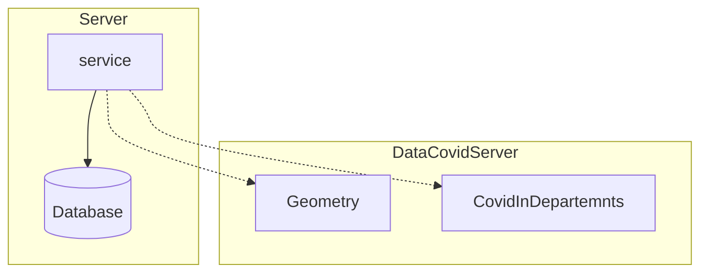

# ColombiaCovidServer
Esta **aplicacion** esta con la finalidad de analizar los datos del virus Covid-19 de manera totalmente educativa y consumirlos en un **_Cliente Web_**.

> Los datos son obtenidos de la pagina [Datos abiertos Esri Colombia](https://datosabiertos.esri.co/).
Exactamente de esta [direccion.](https://datosabiertos.esri.co/datasets/esri-colombia::colombia-covid19-coronavirus-departamento/explore)

La aplicacion basicamente consta en un **_servidor_** que mediante un servicio realiza una peticion a la **_API Publica_** la cual me devuelte los casos registrados desde el inicio hasta el dia actual y diariamente estos datos son guardados en una base de datos localmente.

La **_API Publica_** devuelve tanto la geometria de cada deparatamento del pais como los casos registrados del departamento

En la misma pagina tambien hay una **_API Publica_** que contiene los datos de covid especificos de cada ciudad del departamento. _Posiblemente agregue un servicio que consuma este mas adelante_

# TODO

- [x] Crear un servicio que consuma los datos de __datosabiertos.esri.co__
- [ ] Almacenar los datos en la base de datos
- [ ] Crear un controlador para servir los datos al cliente# covidApp
# covidApp
# covidApp
# covidApp
