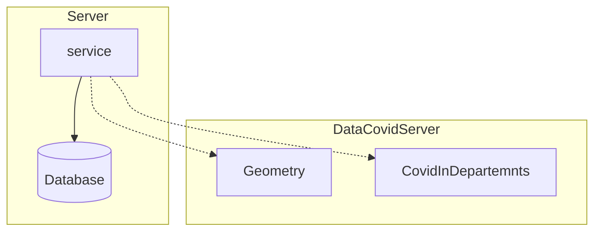

# ColombiaCovidServer

```mermaid
flowchart  TB
    id1[(Database)]
    subgraph Server
    service-->id1
    end
    subgraph DataCovidServer
    service-.->Geometry
    service-.->CovidInDepartemnts
    end
```